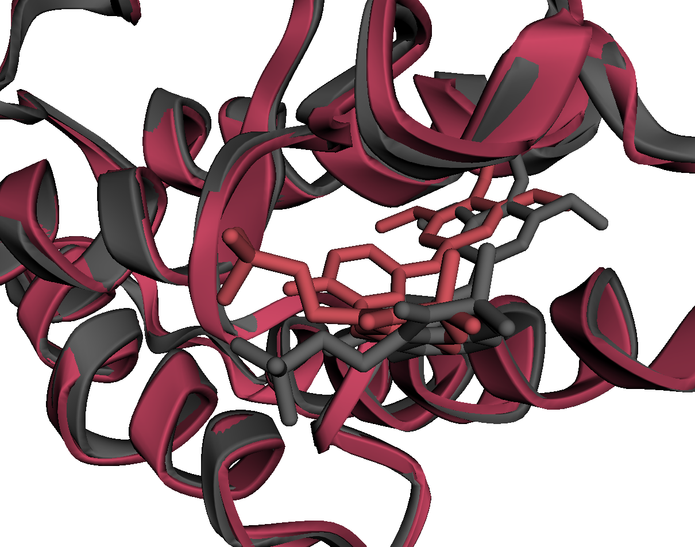
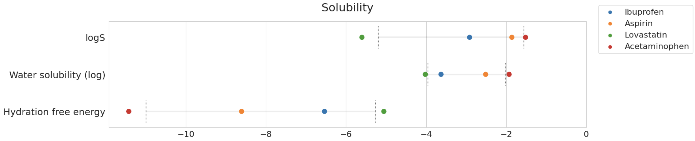
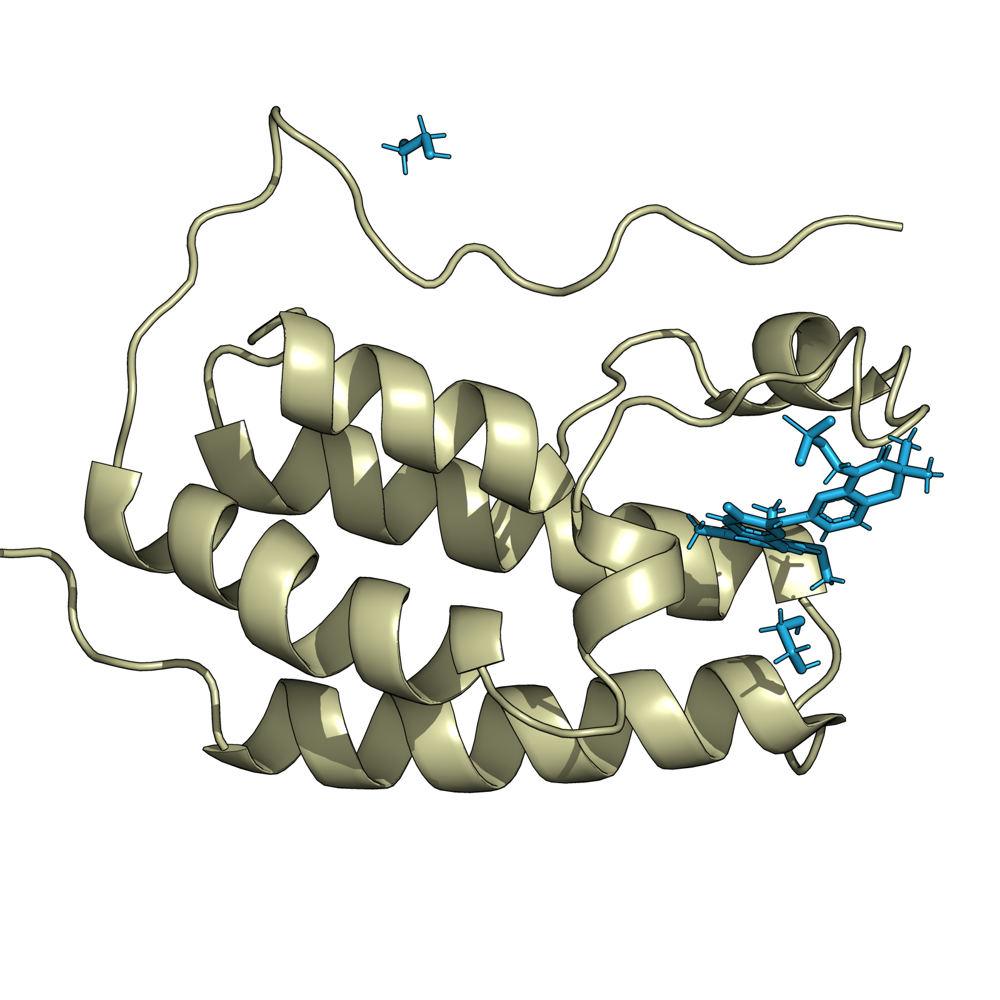
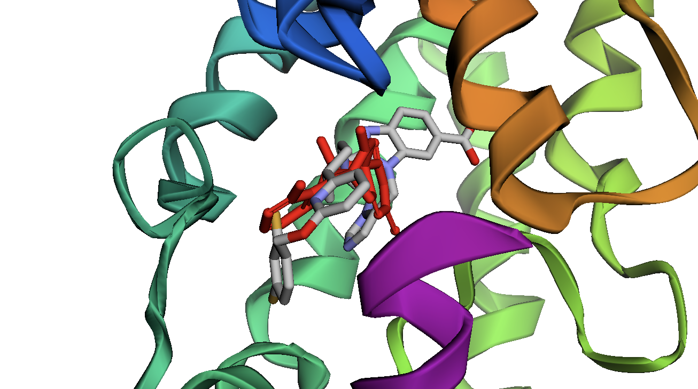

# biocolabs

A collection of colabs useful for molecular biology tasks.
See this [booleanbiotech blogpost](http://blog.booleanbiotech.com/colab-computational-drug-design-2023.html)
for more details.

https://colab.research.google.com/github/hgbrian/biocolabs/blob/master/

## DiffDock

This colab allows you to dock a ligand to a protein with DiffDock, refines the docked position with gnina,
displays the result in the notebook, and downloads all the outputs.

## MD_protein_ligand

This colab allows you to run a simple MD simulation of a protein and a ligand,
displays the result in the notebook, and downloads all the outputs.
The code is from https://github.com/hgbrian/MD_protein_ligand

## SMILES_to_properties

This colab takes as input a SMILES and returns predicted properties, using [chemprop](https://github.com/chemprop/chemprop).

## pdb2png

A simple colab that turns a PDB file into a high-quality PNG using pymol.
The code is from https://github.com/hgbrian/pdb2png.

## Pocket2Mol

A basic colab for running [Pocket2Mol](https://github.com/pengxingang/Pocket2Mol).
Pocket2Mol generates a small molecule to fit a specific pocket.

